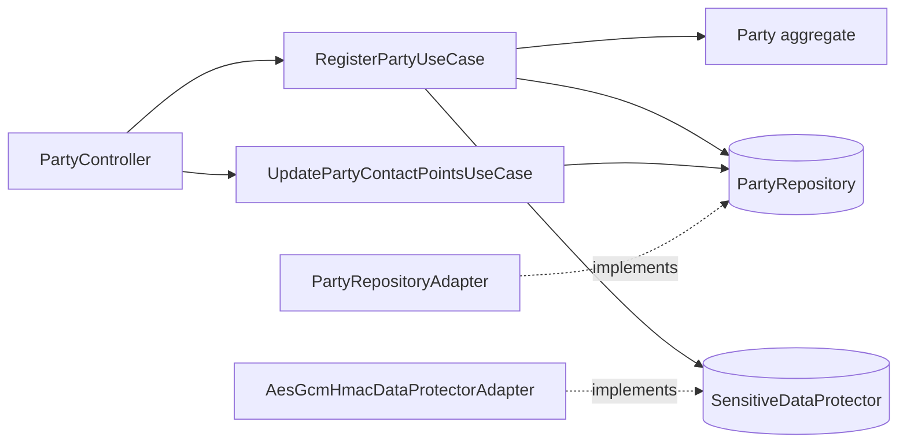
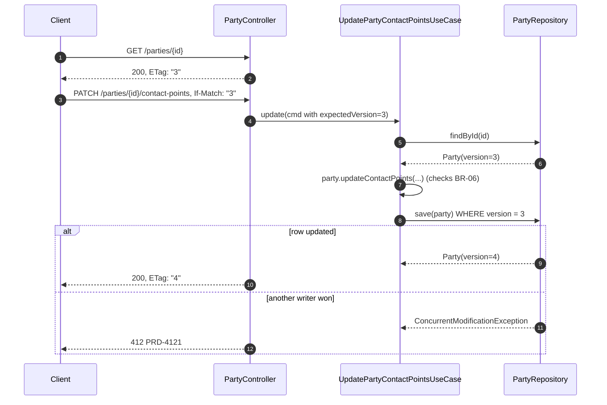
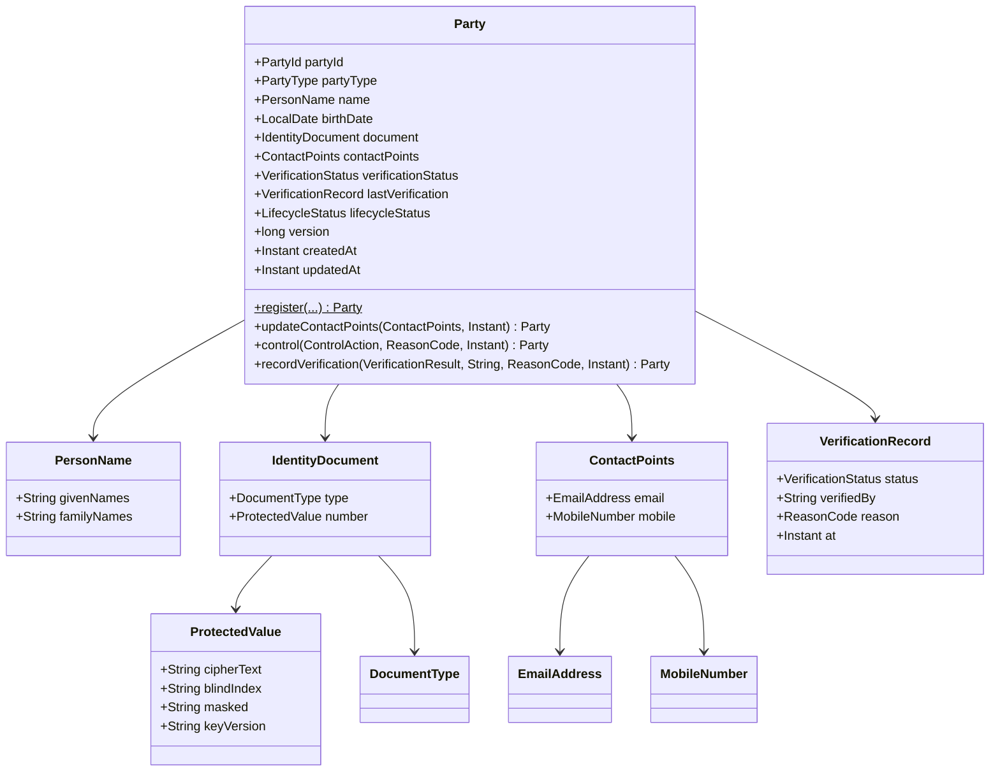
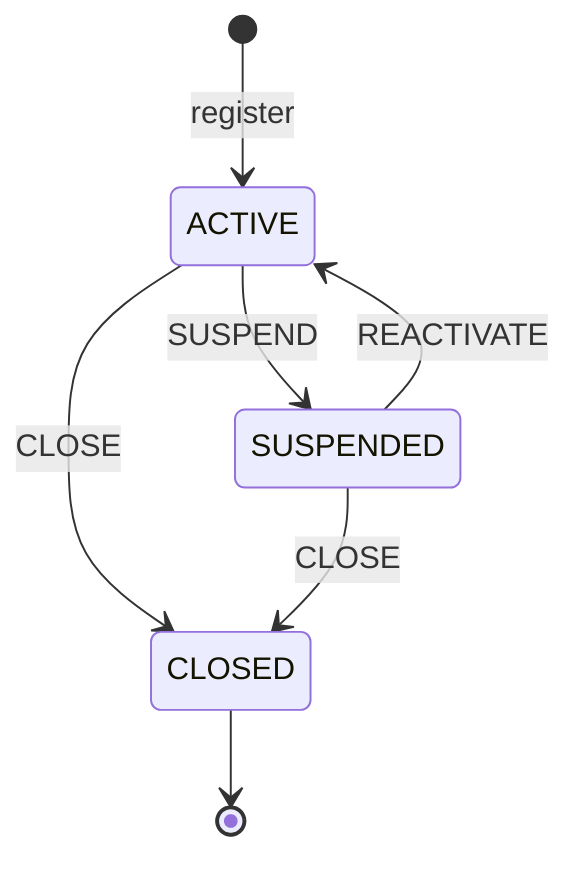
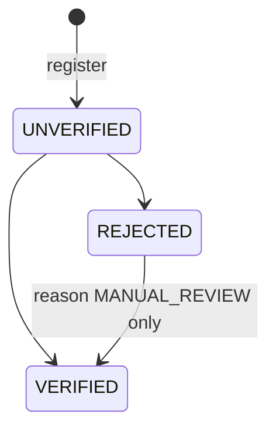

# Party Identity Directory Service

> **Level:** Junior (2 of 3) · **BIAN Service Domain:** Party Reference Data Directory · **Repository:** `party-identity-directory` · **Base package:** `co.com.dmillan.partydir`
> **Stack:** Java 25 · Spring WebFlux (annotated controllers) · R2DBC PostgreSQL · Flyway · AES-GCM + HMAC (JDK crypto) · Spring Security Resource Server

---

## 1. Project Overview

| Attribute | Value |
|---|---|
| Technical name | `party-identity-directory` |
| BIAN Service Domain | Party Reference Data Directory |
| BIAN control record (as modelled here) | Party Reference Data Directory Entry |
| BIAN action terms used | Register, Retrieve, Update, Control |
| Difficulty | Junior |
| Paradigm | Reactive |
| Primary store | PostgreSQL via R2DBC |
| Prerequisites | Project 01 |
| Suggested timebox | 2 weeks part-time |

**Elevator pitch.** Every security decision in a bank starts with "who is this party?". This service is the reference directory for a natural person's identity: legal name, identity document, contact points, verification status, and lifecycle status. It protects the identity document with encryption plus a blind index so the bank can look people up by document without storing the number in clear, and it prevents lost updates with optimistic locking exposed as HTTP `ETag`/`If-Match`.

**What you will build**

- Register a party (natural person) with an identity document and contact points.
- Retrieve a party by id.
- Look up a party by document type + number **via POST** (no PII in URLs).
- Update contact points with optimistic concurrency (`If-Match`).
- Control lifecycle status: suspend, reactivate, close.
- Record verification status: verified or rejected (called by an onboarding/KYC system).

**Out of scope**

- Legal entities (companies), relationships between parties, addresses, and document image storage.
- Real KYC (Know Your Customer) verification against the national registry.

---

## 2. Business Context and Functional Scope

### 2.1 Business problem

Authentication (project 04), second factor (project 05), and fraud evaluation (project 07) all need trustworthy identity data: is the party active, is the identity verified, where do we send an OTP? If each service copies identity data, it goes stale and PII spreads everywhere. A single directory with strict access and encryption reduces both risks.

### 2.2 Actors

| Actor | Interaction | Scope |
|---|---|---|
| Onboarding service | Registers parties, sets verification status | `party-directory:write`, `party-directory:verify` |
| Security services (04, 05, 07) | Retrieve party, read contact points | `party-directory:read` |
| Back-office operations | Suspend / reactivate / close | `party-directory:control` |

### 2.3 Functional requirements

| Id | Requirement |
|---|---|
| FR-01 | Register a natural person with: given names, family names, birth date, document type, document number, email (optional), mobile number (optional, at least one contact point required). |
| FR-02 | Reject registration if a party with the same document type + number already exists (409). |
| FR-03 | Retrieve a party by `partyId`. The response shows the document number **masked** (last 4 digits). |
| FR-04 | Look up a party by document type + number (POST body). Returns the same representation as FR-03. |
| FR-05 | Update contact points (email and/or mobile) with `If-Match: "<version>"`. A stale version returns 412. |
| FR-06 | Change lifecycle status via a control action: `SUSPEND`, `REACTIVATE`, `CLOSE`, with a mandatory reason code. |
| FR-07 | Set verification result: `VERIFIED` or `REJECTED`, with the verifying system and timestamp. |
| FR-08 | A service-to-service endpoint returns **unmasked** contact points for OTP delivery (project 05) — restricted scope `party-directory:contact-read`. |

### 2.4 Business rules

| Id | Rule |
|---|---|
| BR-01 | Document types: `CC` (cédula de ciudadanía), `CE` (cédula de extranjería), `PA` (passport), `PPT` (Permiso por Protección Temporal). |
| BR-02 | `CC`: 6–10 digits. `CE`: 6–7 digits. `PA`: 5–12 alphanumeric uppercase. `PPT`: 6–12 digits. (Simplified for the portfolio; document your source if you refine them.) |
| BR-03 | Birth date must be in the past and the party must be at least 18 years old at registration (adult retail product in this scope). |
| BR-04 | Email: RFC-5322 simplified pattern, lowercase normalized, max 254 chars. Mobile: E.164, Colombian mobiles `+57` followed by 10 digits starting with `3`. |
| BR-05 | Lifecycle transitions: `ACTIVE → SUSPENDED`, `SUSPENDED → ACTIVE`, `ACTIVE → CLOSED`, `SUSPENDED → CLOSED`. `CLOSED` is terminal. |
| BR-06 | Contact points cannot be updated when the party is `CLOSED`. |
| BR-07 | Verification: `UNVERIFIED → VERIFIED` or `UNVERIFIED → REJECTED`. `REJECTED → VERIFIED` allowed only with reason `MANUAL_REVIEW`. `VERIFIED` is final in this version. |
| BR-08 | Names are trimmed; internal multiple spaces collapsed; 1–60 chars each; letters (including accents and ñ), spaces, apostrophes, hyphens. |

### 2.5 BIAN mapping

| Capability | BIAN action term | Endpoint |
|---|---|---|
| Register party | Register | `POST /api/v1/party-reference-data-directory/parties` |
| Retrieve party | Retrieve | `GET /api/v1/party-reference-data-directory/parties/{partyId}` |
| Lookup by document | Retrieve | `POST /api/v1/party-reference-data-directory/parties/search` |
| Update contact points | Update | `PATCH /api/v1/party-reference-data-directory/parties/{partyId}/contact-points` |
| Change lifecycle status | Control | `POST /api/v1/party-reference-data-directory/parties/{partyId}/control` |
| Set verification | Update | `POST /api/v1/party-reference-data-directory/parties/{partyId}/verification` |
| Contact points for OTP | Retrieve | `GET /api/v1/party-reference-data-directory/parties/{partyId}/contact-points` |

---

## 3. Architecture and Learning Objectives

### 3.1 Learning objectives

1. Model an **aggregate** whose methods enforce state transitions (no public setters).
2. Protect PII with a port (`SensitiveDataProtector`) implemented with JDK crypto (AES-GCM for confidentiality, HMAC-SHA256 for the searchable blind index).
3. Implement optimistic locking with R2DBC `@Version` and map it to HTTP `ETag`/`If-Match`/412.
4. Use annotated WebFlux controllers (`@RestController`) and compare them with project 01's functional routes.
5. Design APIs that keep PII out of URLs, logs, and metrics.

### 3.2 Layer map

| Layer | Module | Responsibilities |
|---|---|---|
| Domain | `domain/model` | `Party` aggregate, value objects, `DocumentRules`, `AgePolicy`, gateways, exceptions |
| Domain (application logic) | `domain/usecase` | 6 use cases (section 5.5) |
| Application | `applications/app-service` | Wiring, `ClockConfig`, `CryptoProperties` binding, `application.yaml` |
| Entry Points | `infrastructure/entry-points/reactive-web` | `PartyController`, `PartyControlController`, DTOs, `ETagSupport`, error handler, security |
| Driven Adapters | `infrastructure/driven-adapters/r2dbc-postgresql` | `PartyEntity`, `ContactPointEntity`, repositories, adapter |
| Driven Adapters | `infrastructure/driven-adapters/crypto` | `AesGcmHmacDataProtectorAdapter` |
| Driven Adapters | `infrastructure/driven-adapters/id-generator` | `UuidIdGeneratorAdapter` |

### 3.3 Dependency direction



The use case asks the port for "protect this document number"; it does not know whether the implementation uses a local key, AWS KMS, or an HSM. In project 05 you will add a KMS-based implementation of a similar port without touching use cases — this is the payoff of the dependency rule.

### 3.4 Scaffold commands

```shell
gradle ca --package=co.com.dmillan.partydir --type=reactive --name=party-identity-directory --lombok=true --metrics=true --mutation=true
gradle gm  --name=Party
gradle guc --name=RegisterParty
gradle guc --name=RetrieveParty
gradle guc --name=LookupPartyByDocument
gradle guc --name=UpdatePartyContactPoints
gradle guc --name=ControlPartyStatus
gradle guc --name=RecordPartyVerification
gradle gda --type=r2dbc
gradle gda --type=generic --name=crypto
gradle gda --type=generic --name=id-generator
gradle gep --type=webflux --router=false
gradle validateStructure
```

### 3.5 Update flow with optimistic locking



Check `expectedVersion` against the loaded version **before** saving (fail fast, 412) and rely on the database version check for the race in between.

### 3.6 Design decisions

| Decision | Choice | Why |
|---|---|---|
| Document storage | AES-256-GCM ciphertext + HMAC-SHA256 blind index + masked value | Lookup by equality without clear storage; masked value avoids decrypting for display |
| Key source | Base64 keys from environment/Secrets Manager (two distinct keys: encryption and HMAC) | Junior-level; KMS envelope encryption comes in project 05 |
| Lookup method | `POST /parties/search` | URLs end up in access logs, proxies, and browser history |
| Contact points table | Separate table `party_contact_point` | Prepares for multiple contact points and history later |
| Controller style | Annotated | Compare with functional routes; both are valid in the scaffold |

---

## 4. Detailed Domain Model

### 4.1 Class diagram



### 4.2 Types

| Type | Kind | Attributes | Rules |
|---|---|---|---|
| `Party` | Aggregate root | see diagram | Methods return a **new** instance (`toBuilder`) with `updatedAt` set; never mutate |
| `PartyId` | VO | `UUID value` | — |
| `PartyType` | Enum | `NATURAL_PERSON` | Only value in this version |
| `PersonName` | VO | `givenNames`, `familyNames` | BR-08 normalization in compact constructor |
| `DocumentType` | Enum | `CC`, `CE`, `PA`, `PPT` | Each constant holds its regex (BR-02) |
| `RawDocument` | VO | `DocumentType type`, `String number` | Validated with `DocumentRules`; **never** stored or logged; `toString()` returns masked form |
| `IdentityDocument` | VO | `DocumentType type`, `ProtectedValue number` | — |
| `ProtectedValue` | VO | `cipherText` (Base64 of IV‖ciphertext‖tag), `blindIndex` (hex), `masked`, `keyVersion` | All non-blank |
| `EmailAddress` | VO | `String value` | BR-04; lowercase |
| `MobileNumber` | VO | `String value` | BR-04 E.164 |
| `ContactPoints` | VO | `EmailAddress email`, `MobileNumber mobile` | At least one non-null |
| `LifecycleStatus` | Enum | `ACTIVE`, `SUSPENDED`, `CLOSED` | `boolean canTransitionTo(LifecycleStatus)` |
| `VerificationStatus` | Enum | `UNVERIFIED`, `VERIFIED`, `REJECTED` | — |
| `ControlAction` | Enum | `SUSPEND`, `REACTIVATE`, `CLOSE` | `LifecycleStatus target()` |
| `ReasonCode` | Enum | `CUSTOMER_REQUEST`, `FRAUD_SUSPECTED`, `REGULATORY_HOLD`, `DECEASED`, `DATA_MISMATCH`, `MANUAL_REVIEW`, `OTHER` | — |
| `VerificationResult` | Enum | `VERIFIED`, `REJECTED` | — |
| `VerificationRecord` | VO | see diagram | — |
| `RegisterPartyCommand` | Command | names, birthDate, `RawDocument`, email, mobile, requestedBy | — |
| `UpdateContactPointsCommand` | Command | `PartyId`, `long expectedVersion`, `EmailAddress`, `MobileNumber` (nullable = keep) | — |
| `ControlPartyCommand` | Command | `PartyId`, `ControlAction`, `ReasonCode`, `long expectedVersion`, `String requestedBy` | — |
| `RecordVerificationCommand` | Command | `PartyId`, `VerificationResult`, `ReasonCode`, `String verifiedBy` | — |

### 4.3 State machines





### 4.4 Domain services

| Service | Signature intent |
|---|---|
| `DocumentRules` | Validate `RawDocument` format per type (BR-02) |
| `AgePolicy` | `void requireAdult(LocalDate birthDate)` using injected `Clock` and zone `America/Bogota` |
| `DocumentMasker` | Last 4 visible, rest `*` — used by the crypto adapter through the port result, and by `RawDocument.toString()` |

### 4.5 Domain events (logged now, published in later projects)

`PartyRegistered`, `PartyContactPointsUpdated`, `PartyStatusChanged`, `PartyVerificationRecorded` — records with `partyId`, `occurredAt`, and the minimal changed attributes (never the document number). In this project, the use case returns them alongside the aggregate so the entry point can log them; no broker yet.

---

## 5. Detailed Class and Package Specification

### 5.1 Package tree

```text
party-identity-directory/
├── applications/app-service/src/main/java/co/com/dmillan/partydir/
│   ├── MainApplication.java
│   └── config/{UseCasesConfig, DomainServicesConfig, ClockConfig}.java
├── domain/model/src/main/java/co/com/dmillan/partydir/model/
│   ├── party/
│   │   ├── Party.java
│   │   ├── PartyId.java  PartyType.java  PersonName.java
│   │   ├── DocumentType.java  RawDocument.java  IdentityDocument.java  ProtectedValue.java
│   │   ├── EmailAddress.java  MobileNumber.java  ContactPoints.java
│   │   ├── LifecycleStatus.java  VerificationStatus.java  VerificationResult.java
│   │   ├── ControlAction.java  ReasonCode.java  VerificationRecord.java
│   │   ├── command/{RegisterPartyCommand, UpdateContactPointsCommand, ControlPartyCommand, RecordVerificationCommand}.java
│   │   ├── event/{PartyEvent, PartyRegistered, PartyContactPointsUpdated, PartyStatusChanged, PartyVerificationRecorded}.java
│   │   ├── service/{DocumentRules, AgePolicy, DocumentMasker}.java
│   │   └── gateways/{PartyRepository, SensitiveDataProtector}.java
│   └── commons/
│       ├── gateways/IdGenerator.java
│       ├── Versioned.java
│       └── exception/{ErrorCode, BusinessErrorCode, TechnicalErrorCode, BusinessException, TechnicalException, ConcurrentModificationException, DuplicatePartyException}.java
├── domain/usecase/src/main/java/co/com/dmillan/partydir/usecase/
│   ├── registerparty/RegisterPartyUseCase.java
│   ├── retrieveparty/RetrievePartyUseCase.java
│   ├── lookuppartybydocument/LookupPartyByDocumentUseCase.java
│   ├── updatepartycontactpoints/UpdatePartyContactPointsUseCase.java
│   ├── controlpartystatus/ControlPartyStatusUseCase.java
│   └── recordpartyverification/RecordPartyVerificationUseCase.java
├── infrastructure/entry-points/reactive-web/src/main/java/co/com/dmillan/partydir/api/
│   ├── PartyController.java
│   ├── PartyControlController.java
│   ├── config/SecurityConfig.java
│   ├── dto/common/...           (shared envelope DTOs, see index §3.6–3.7)
│   ├── dto/{RegisterPartyRequest, PartySearchRequest, UpdateContactPointsRequest, ControlPartyRequest, VerificationRequest, PartyResponse, ContactPointsResponse, NameDto, DocumentDto}.java
│   ├── mapper/PartyDtoMapper.java
│   ├── support/{ETagSupport, RequestContext, RequestContextResolver}.java
│   └── error/{GlobalErrorHandler, ErrorHttpStatusMapper}.java
├── infrastructure/driven-adapters/r2dbc-postgresql/src/main/java/co/com/dmillan/partydir/r2dbc/
│   ├── PartyEntity.java
│   ├── ContactPointEntity.java
│   ├── PartyDataRepository.java
│   ├── ContactPointDataRepository.java
│   ├── PartyRepositoryAdapter.java
│   └── PartyEntityMapper.java
├── infrastructure/driven-adapters/crypto/src/main/java/co/com/dmillan/partydir/crypto/
│   ├── AesGcmHmacDataProtectorAdapter.java
│   ├── CryptoProperties.java
│   └── KeyMaterial.java
└── infrastructure/driven-adapters/id-generator/.../UuidIdGeneratorAdapter.java
```

### 5.2 Aggregate — signatures

```java
@Builder(toBuilder = true)
public record Party(
    PartyId partyId, PartyType partyType, PersonName name, LocalDate birthDate,
    IdentityDocument document, ContactPoints contactPoints,
    VerificationStatus verificationStatus, VerificationRecord lastVerification,
    LifecycleStatus lifecycleStatus, long version, Instant createdAt, Instant updatedAt) {

  public static Party register(PartyId id, PersonName name, LocalDate birthDate,
                               IdentityDocument document, ContactPoints contactPoints, Instant now);

  public Party updateContactPoints(ContactPoints newContactPoints, Instant now);        // BR-06
  public Party control(ControlAction action, ReasonCode reason, Instant now);          // BR-05
  public Party recordVerification(VerificationResult result, String verifiedBy,
                                  ReasonCode reason, Instant now);                     // BR-07
  public boolean isOperable();                                                         // ACTIVE and not REJECTED
  public void requireVersion(long expectedVersion);                                    // throws ConcurrentModificationException
}
```

```java
public enum LifecycleStatus { ACTIVE, SUSPENDED, CLOSED;
  public boolean canTransitionTo(LifecycleStatus target); }

public enum DocumentType { CC("^\\d{6,10}$"), CE("^\\d{6,7}$"), PA("^[A-Z0-9]{5,12}$"), PPT("^\\d{6,12}$");
  public boolean accepts(String number); }

public record RawDocument(DocumentType type, String number) {
  public RawDocument { /* normalize: trim, uppercase, remove dots/spaces; validate */ }
  @Override public String toString();   // "CC ******4567"
}

public record ContactPoints(EmailAddress email, MobileNumber mobile) {
  public ContactPoints { /* at least one */ }
  public ContactPoints merge(EmailAddress newEmail, MobileNumber newMobile); // null = keep current
}
```

### 5.3 Gateways — signatures

```java
public interface PartyRepository {
  Mono<Party> create(Party party);                        // DuplicatePartyException on blind-index unique violation
  Mono<Party> update(Party party);                        // ConcurrentModificationException when version check fails
  Mono<Party> findById(PartyId partyId);
  Mono<Party> findByDocumentIndex(DocumentType type, String blindIndex);
  Mono<Boolean> existsByDocumentIndex(DocumentType type, String blindIndex);
}

public interface SensitiveDataProtector {
  ProtectedValue protect(String clearValue);              // encrypt + blind index + mask
  String blindIndex(String clearValue);                   // deterministic HMAC for lookups
  String reveal(ProtectedValue value);                    // decrypt (only for authorized flows)
}

public interface IdGenerator { UUID newId(); }
```

> Design question to answer in an ADR: should `SensitiveDataProtector` return `Mono<ProtectedValue>`? Local AES is CPU-bound and fast; KMS is a network call. Choosing `Mono` now makes the port future-proof (project 05 uses KMS). Pick one and justify it.

### 5.4 Exceptions

```java
public enum BusinessErrorCode implements ErrorCode {
  PRD_4001_INVALID_REQUEST, PRD_4002_INVALID_DOCUMENT, PRD_4003_UNDERAGE,
  PRD_4004_CONTACT_POINT_REQUIRED, PRD_4005_INVALID_CONTACT_POINT,
  PRD_4011_MISSING_HEADER, PRD_4041_PARTY_NOT_FOUND, PRD_4091_PARTY_ALREADY_EXISTS,
  PRD_4221_INVALID_STATUS_TRANSITION, PRD_4222_PARTY_CLOSED, PRD_4223_INVALID_VERIFICATION_TRANSITION,
  PRD_4281_IF_MATCH_REQUIRED, PRD_4121_VERSION_MISMATCH;
}
public enum TechnicalErrorCode implements ErrorCode {
  PRD_5000_UNEXPECTED, PRD_5001_PERSISTENCE_UNAVAILABLE, PRD_5002_CRYPTO_FAILURE;
}
public class ConcurrentModificationException extends BusinessException { public ConcurrentModificationException(PartyId id, long expected, long actual); }
public class DuplicatePartyException extends RuntimeException { public DuplicatePartyException(); }
```

### 5.5 Use cases — signatures and steps

```java
public class RegisterPartyUseCase {
  public RegisterPartyUseCase(PartyRepository repository, SensitiveDataProtector protector,
                              IdGenerator idGenerator, DocumentRules documentRules, AgePolicy agePolicy, Clock clock);
  public Mono<Party> register(RegisterPartyCommand command);
}
```
Steps: validate document (`DocumentRules`) and age (`AgePolicy`) → `blindIndex` → `existsByDocumentIndex` → if true `PRD-4091` → `protect` → `Party.register` → `create` → translate `DuplicatePartyException` (race) to `PRD-4091`.

```java
public class RetrievePartyUseCase {
  public Mono<Party> retrieve(PartyId partyId);                              // empty → PRD-4041
}
public class LookupPartyByDocumentUseCase {
  public Mono<Party> lookup(RawDocument document);                           // blindIndex → findByDocumentIndex → PRD-4041
}
public class UpdatePartyContactPointsUseCase {
  public Mono<Party> update(UpdateContactPointsCommand command);             // load → requireVersion → updateContactPoints → update
}
public class ControlPartyStatusUseCase {
  public Mono<Party> control(ControlPartyCommand command);                   // load → requireVersion → control → update
}
public class RecordPartyVerificationUseCase {
  public Mono<Party> record(RecordVerificationCommand command);              // load → recordVerification → update (no If-Match: system actor; retry once on conflict)
}
public class RetrievePartyContactPointsUseCase {
  public Mono<ContactPoints> retrieve(PartyId partyId);                      // only if isOperable(); else PRD-4222 or PRD-4221
}
```

(`RetrievePartyContactPointsUseCase` is the seventh use case; generate it with `gradle guc --name=RetrievePartyContactPoints`.)

**Lookup timing note:** `findByDocumentIndex` returns empty for unknown documents quickly; that is acceptable here because the endpoint is service-to-service only. Discuss in the interview why it would be a user-enumeration risk if exposed to the public.

### 5.6 Entry points — signatures

```java
@RestController
@RequestMapping(value = "/api/v1/party-reference-data-directory/parties", produces = MediaType.APPLICATION_JSON_VALUE)
@RequiredArgsConstructor
public class PartyController {

  @PostMapping
  @PreAuthorize("hasAuthority('SCOPE_party-directory:write')")
  public Mono<ResponseEntity<ApiResponse<PartyResponse>>> register(
      @RequestHeader("X-Message-Id") String messageId, @RequestHeader("X-Client-Id") String clientId,
      @Valid @RequestBody RegisterPartyRequest request);

  @GetMapping("/{partyId}")
  @PreAuthorize("hasAuthority('SCOPE_party-directory:read')")
  public Mono<ResponseEntity<ApiResponse<PartyResponse>>> retrieve(
      @RequestHeader("X-Message-Id") String messageId, @RequestHeader("X-Client-Id") String clientId,
      @PathVariable UUID partyId);

  @PostMapping("/search")
  @PreAuthorize("hasAuthority('SCOPE_party-directory:read')")
  public Mono<ResponseEntity<ApiResponse<PartyResponse>>> search(
      @RequestHeader("X-Message-Id") String messageId, @RequestHeader("X-Client-Id") String clientId,
      @Valid @RequestBody PartySearchRequest request);

  @PatchMapping("/{partyId}/contact-points")
  @PreAuthorize("hasAuthority('SCOPE_party-directory:write')")
  public Mono<ResponseEntity<ApiResponse<PartyResponse>>> updateContactPoints(
      @RequestHeader("X-Message-Id") String messageId, @RequestHeader("X-Client-Id") String clientId,
      @RequestHeader(value = HttpHeaders.IF_MATCH, required = false) String ifMatch,
      @PathVariable UUID partyId, @Valid @RequestBody UpdateContactPointsRequest request);

  @GetMapping("/{partyId}/contact-points")
  @PreAuthorize("hasAuthority('SCOPE_party-directory:contact-read')")
  public Mono<ResponseEntity<ApiResponse<ContactPointsResponse>>> contactPoints(
      @RequestHeader("X-Message-Id") String messageId, @RequestHeader("X-Client-Id") String clientId,
      @PathVariable UUID partyId);
}

@RestController
@RequestMapping("/api/v1/party-reference-data-directory/parties/{partyId}")
public class PartyControlController {
  @PostMapping("/control")
  @PreAuthorize("hasAuthority('SCOPE_party-directory:control')")
  public Mono<ResponseEntity<ApiResponse<PartyResponse>>> control(/* headers, If-Match, partyId, @Valid ControlPartyRequest */);

  @PostMapping("/verification")
  @PreAuthorize("hasAuthority('SCOPE_party-directory:verify')")
  public Mono<ResponseEntity<ApiResponse<PartyResponse>>> verify(/* headers, partyId, @Valid VerificationRequest */);
}

public final class ETagSupport {
  public static String toETag(long version);                 // "\"4\""
  public static long parseIfMatch(String ifMatch);           // missing → PRD-4281 (428); malformed → PRD-4001
}
```

Security config must enable `@EnableReactiveMethodSecurity` for `@PreAuthorize`.

### 5.7 DTOs

```java
public record RegisterPartyRequest(
  @NotNull @Valid NameDto name,
  @NotNull @Past LocalDate birthDate,
  @NotNull @Valid DocumentDto document,
  @Email @Size(max = 254) String email,
  @Pattern(regexp = "^\\+573\\d{9}$") String mobile) {}

public record NameDto(
  @NotBlank @Size(max = 60) @Pattern(regexp = "^[\\p{L} '\\-]+$") String givenNames,
  @NotBlank @Size(max = 60) @Pattern(regexp = "^[\\p{L} '\\-]+$") String familyNames) {}

public record DocumentDto(@NotNull DocumentType type, @NotBlank @Size(max = 20) String number) {}
public record PartySearchRequest(@NotNull @Valid DocumentDto document) {}
public record UpdateContactPointsRequest(@Email @Size(max = 254) String email,
                                         @Pattern(regexp = "^\\+573\\d{9}$") String mobile) {}
public record ControlPartyRequest(@NotNull ControlAction action, @NotNull ReasonCode reason) {}
public record VerificationRequest(@NotNull VerificationResult result, @NotNull ReasonCode reason,
                                  @NotBlank @Size(max = 64) String verifiedBy) {}

public record PartyResponse(
  String partyId, String partyType, NameDto name, LocalDate birthDate,
  String documentType, String documentNumberMasked,
  String emailMasked, String mobileMasked,
  String verificationStatus, String lifecycleStatus, long version,
  Instant createdAt, Instant updatedAt) {}

public record ContactPointsResponse(String email, String mobile) {}   // unmasked, restricted scope
```

Masking for responses: email `j***@dominio.com`, mobile `+57******4567`. Put these two maskers in the mapper (presentation concern) — and be ready to explain why document masking is domain but email masking is presentation here (hint: the domain stores only the masked document; email is stored in clear because it must be usable).

### 5.8 Driven adapters — signatures

```java
@Table("party")
public record PartyEntity(@Id UUID partyId, String partyType, String givenNames, String familyNames,
  LocalDate birthDate, String documentType, String documentCipherText, String documentBlindIndex,
  String documentMasked, String documentKeyVersion, String verificationStatus,
  String verifiedBy, String verificationReason, Instant verifiedAt,
  String lifecycleStatus, String lastStatusReason,
  @Version Long version, Instant createdAt, Instant updatedAt) {}

@Table("party_contact_point")
public record ContactPointEntity(@Id UUID contactPointId, UUID partyId, String type, String value,
  Instant createdAt, Instant updatedAt) {}

public interface PartyDataRepository extends ReactiveCrudRepository<PartyEntity, UUID> {
  Mono<PartyEntity> findByDocumentTypeAndDocumentBlindIndex(String type, String blindIndex);
  Mono<Boolean> existsByDocumentTypeAndDocumentBlindIndex(String type, String blindIndex);
}

public interface ContactPointDataRepository extends ReactiveCrudRepository<ContactPointEntity, UUID> {
  Flux<ContactPointEntity> findByPartyId(UUID partyId);
  Mono<Void> deleteByPartyIdAndType(UUID partyId, String type);
}

@Repository
@RequiredArgsConstructor
public class PartyRepositoryAdapter implements PartyRepository {
  private final PartyDataRepository partyRepository;
  private final ContactPointDataRepository contactPointRepository;
  private final TransactionalOperator transactionalOperator;   // party + contact points atomically
  // create/update wrap both writes in transactionalOperator::transactional
  // OptimisticLockingFailureException → ConcurrentModificationException
  // DuplicateKeyException on uk_party_document → DuplicatePartyException
}

@Component
@RequiredArgsConstructor
public class AesGcmHmacDataProtectorAdapter implements SensitiveDataProtector {
  private final KeyMaterial keyMaterial;
  // AES/GCM/NoPadding, 12-byte random IV per value, 128-bit tag, output Base64(IV || ciphertext || tag)
  // HmacSHA256 with a separate key; input normalized (type-independent) → lowercase hex
}

@ConfigurationProperties(prefix = "partydir.crypto")
public record CryptoProperties(String encryptionKeyBase64, String hmacKeyBase64, String keyVersion) {}

public final class KeyMaterial {
  public KeyMaterial(CryptoProperties properties);   // decode, validate 32-byte keys, fail at startup otherwise
  public SecretKey encryptionKey();
  public SecretKey hmacKey();
  public String keyVersion();
}
```

**Transaction note:** `@Version` with a Java `record` requires the adapter to build a new entity with the incremented version returned by `save`. Verify how your Spring Data version handles immutable entities with `@Version` (it uses a "wither"/all-args constructor). Write a Testcontainers test that proves a stale version fails.

### 5.9 Unit tests you must write

`PartyTest` (all transitions, including invalid ones), `DocumentTypeTest`, `RawDocumentTest` (normalization, `toString` masking), `ContactPointsTest`, `AgePolicyTest` (birthday today edge case in Bogotá time zone), `RegisterPartyUseCaseTest` (duplicate, race), `UpdatePartyContactPointsUseCaseTest` (version mismatch), `AesGcmHmacDataProtectorAdapterTest` (round trip, IV uniqueness, deterministic blind index, tampered ciphertext fails), `PartyControllerTest` (`WebTestClient`, `@WebFluxTest`, ETag headers), `PartyRepositoryAdapterTest` (Testcontainers).

---

## 6. API and OpenAPI Contract

### 6.1 Endpoints

| Method | Path | Scope | Success | Notable errors |
|---|---|---|---|---|
| POST | `/parties` | `party-directory:write` | 201 + `ETag` + `Location` | 400, 409, 422 |
| GET | `/parties/{partyId}` | `party-directory:read` | 200 + `ETag` | 404 |
| POST | `/parties/search` | `party-directory:read` | 200 + `ETag` | 404 |
| PATCH | `/parties/{partyId}/contact-points` | `party-directory:write` | 200 + `ETag` | 404, 412, 422, 428 |
| POST | `/parties/{partyId}/control` | `party-directory:control` | 200 + `ETag` | 404, 412, 422, 428 |
| POST | `/parties/{partyId}/verification` | `party-directory:verify` | 200 + `ETag` | 404, 422 |
| GET | `/parties/{partyId}/contact-points` | `party-directory:contact-read` | 200 | 404, 422 |

All paths are prefixed with `/api/v1/party-reference-data-directory`.

### 6.2 OpenAPI

```yaml
openapi: 3.0.3
info:
  title: Party Reference Data Directory - Party Identity Directory
  version: 1.0.0
security:
  - bearerAuth: []
paths:
  /api/v1/party-reference-data-directory/parties:
    post:
      operationId: registerParty
      summary: Register a natural person (BIAN action term Register)
      parameters:
        - $ref: '#/components/parameters/XMessageId'
        - $ref: '#/components/parameters/XClientId'
      requestBody:
        required: true
        content:
          application/json:
            schema: { $ref: '#/components/schemas/RegisterPartyRequest' }
      responses:
        '201':
          description: Registered
          headers:
            ETag: { schema: { type: string } }
            Location: { schema: { type: string } }
          content:
            application/json:
              schema: { $ref: '#/components/schemas/PartyEnvelope' }
        '400': { $ref: '#/components/responses/Error' }
        '409': { $ref: '#/components/responses/Error' }
        '422': { $ref: '#/components/responses/Error' }
  /api/v1/party-reference-data-directory/parties/search:
    post:
      operationId: lookupPartyByDocument
      summary: Look up a party by identity document
      parameters:
        - $ref: '#/components/parameters/XMessageId'
        - $ref: '#/components/parameters/XClientId'
      requestBody:
        required: true
        content:
          application/json:
            schema:
              type: object
              required: [document]
              properties:
                document: { $ref: '#/components/schemas/Document' }
      responses:
        '200':
          description: Found
          headers:
            ETag: { schema: { type: string } }
          content:
            application/json:
              schema: { $ref: '#/components/schemas/PartyEnvelope' }
        '404': { $ref: '#/components/responses/Error' }
  /api/v1/party-reference-data-directory/parties/{partyId}:
    get:
      operationId: retrieveParty
      parameters:
        - $ref: '#/components/parameters/XMessageId'
        - $ref: '#/components/parameters/XClientId'
        - $ref: '#/components/parameters/PartyId'
      responses:
        '200':
          description: Found
          headers:
            ETag: { schema: { type: string } }
          content:
            application/json:
              schema: { $ref: '#/components/schemas/PartyEnvelope' }
        '404': { $ref: '#/components/responses/Error' }
  /api/v1/party-reference-data-directory/parties/{partyId}/contact-points:
    patch:
      operationId: updatePartyContactPoints
      parameters:
        - $ref: '#/components/parameters/XMessageId'
        - $ref: '#/components/parameters/XClientId'
        - $ref: '#/components/parameters/PartyId'
        - $ref: '#/components/parameters/IfMatch'
      requestBody:
        required: true
        content:
          application/json:
            schema:
              type: object
              properties:
                email: { type: string, format: email, maxLength: 254 }
                mobile: { type: string, pattern: '^\+573\d{9}$' }
      responses:
        '200':
          description: Updated
          headers:
            ETag: { schema: { type: string } }
          content:
            application/json:
              schema: { $ref: '#/components/schemas/PartyEnvelope' }
        '404': { $ref: '#/components/responses/Error' }
        '412': { $ref: '#/components/responses/Error' }
        '422': { $ref: '#/components/responses/Error' }
        '428': { $ref: '#/components/responses/Error' }
    get:
      operationId: retrievePartyContactPoints
      summary: Unmasked contact points for OTP delivery (restricted scope)
      parameters:
        - $ref: '#/components/parameters/XMessageId'
        - $ref: '#/components/parameters/XClientId'
        - $ref: '#/components/parameters/PartyId'
      responses:
        '200':
          description: Contact points
          content:
            application/json:
              schema:
                type: object
                properties:
                  data:
                    type: object
                    properties:
                      meta: { $ref: '#/components/schemas/Meta' }
                      payload:
                        type: object
                        properties:
                          email: { type: string }
                          mobile: { type: string }
        '404': { $ref: '#/components/responses/Error' }
        '422': { $ref: '#/components/responses/Error' }
  /api/v1/party-reference-data-directory/parties/{partyId}/control:
    post:
      operationId: controlPartyStatus
      summary: Suspend, reactivate or close (BIAN action term Control)
      parameters:
        - $ref: '#/components/parameters/XMessageId'
        - $ref: '#/components/parameters/XClientId'
        - $ref: '#/components/parameters/PartyId'
        - $ref: '#/components/parameters/IfMatch'
      requestBody:
        required: true
        content:
          application/json:
            schema:
              type: object
              required: [action, reason]
              properties:
                action: { type: string, enum: [SUSPEND, REACTIVATE, CLOSE] }
                reason: { $ref: '#/components/schemas/ReasonCode' }
      responses:
        '200':
          description: Status changed
          content:
            application/json:
              schema: { $ref: '#/components/schemas/PartyEnvelope' }
        '412': { $ref: '#/components/responses/Error' }
        '422': { $ref: '#/components/responses/Error' }
        '428': { $ref: '#/components/responses/Error' }
  /api/v1/party-reference-data-directory/parties/{partyId}/verification:
    post:
      operationId: recordPartyVerification
      parameters:
        - $ref: '#/components/parameters/XMessageId'
        - $ref: '#/components/parameters/XClientId'
        - $ref: '#/components/parameters/PartyId'
      requestBody:
        required: true
        content:
          application/json:
            schema:
              type: object
              required: [result, reason, verifiedBy]
              properties:
                result: { type: string, enum: [VERIFIED, REJECTED] }
                reason: { $ref: '#/components/schemas/ReasonCode' }
                verifiedBy: { type: string, maxLength: 64 }
      responses:
        '200':
          description: Verification recorded
          content:
            application/json:
              schema: { $ref: '#/components/schemas/PartyEnvelope' }
        '422': { $ref: '#/components/responses/Error' }
components:
  securitySchemes:
    bearerAuth: { type: http, scheme: bearer, bearerFormat: JWT }
  parameters:
    XMessageId: { name: X-Message-Id, in: header, required: true, schema: { type: string, format: uuid } }
    XClientId: { name: X-Client-Id, in: header, required: true, schema: { type: string, maxLength: 64 } }
    PartyId: { name: partyId, in: path, required: true, schema: { type: string, format: uuid } }
    IfMatch: { name: If-Match, in: header, required: true, schema: { type: string, example: '"3"' } }
  responses:
    Error:
      description: Error envelope
      content:
        application/json:
          schema: { $ref: '#/components/schemas/ErrorResponse' }
  schemas:
    ReasonCode:
      type: string
      enum: [CUSTOMER_REQUEST, FRAUD_SUSPECTED, REGULATORY_HOLD, DECEASED, DATA_MISMATCH, MANUAL_REVIEW, OTHER]
    Document:
      type: object
      required: [type, number]
      properties:
        type: { type: string, enum: [CC, CE, PA, PPT] }
        number: { type: string, maxLength: 20 }
    Name:
      type: object
      required: [givenNames, familyNames]
      properties:
        givenNames: { type: string, maxLength: 60 }
        familyNames: { type: string, maxLength: 60 }
    RegisterPartyRequest:
      type: object
      required: [name, birthDate, document]
      properties:
        name: { $ref: '#/components/schemas/Name' }
        birthDate: { type: string, format: date }
        document: { $ref: '#/components/schemas/Document' }
        email: { type: string, format: email }
        mobile: { type: string, pattern: '^\+573\d{9}$' }
    Party:
      type: object
      properties:
        partyId: { type: string, format: uuid }
        partyType: { type: string, enum: [NATURAL_PERSON] }
        name: { $ref: '#/components/schemas/Name' }
        birthDate: { type: string, format: date }
        documentType: { type: string }
        documentNumberMasked: { type: string, example: '******4567' }
        emailMasked: { type: string, example: 'j***@example.com' }
        mobileMasked: { type: string, example: '+57******4567' }
        verificationStatus: { type: string, enum: [UNVERIFIED, VERIFIED, REJECTED] }
        lifecycleStatus: { type: string, enum: [ACTIVE, SUSPENDED, CLOSED] }
        version: { type: integer, format: int64 }
        createdAt: { type: string, format: date-time }
        updatedAt: { type: string, format: date-time }
    Meta:
      type: object
      properties:
        messageId: { type: string }
        clientId: { type: string }
        timestamp: { type: string, format: date-time }
    PartyEnvelope:
      type: object
      properties:
        data:
          type: object
          properties:
            meta: { $ref: '#/components/schemas/Meta' }
            payload: { $ref: '#/components/schemas/Party' }
    ErrorResponse:
      type: object
      properties:
        meta: { $ref: '#/components/schemas/Meta' }
        errors:
          type: array
          items:
            type: object
            properties:
              status: { type: string }
              code: { type: string }
              title: { type: string }
              detail: { type: string }
```

### 6.3 Examples

Register request:

```json
{
  "name": { "givenNames": "María José", "familyNames": "Restrepo Gómez" },
  "birthDate": "1991-04-12",
  "document": { "type": "CC", "number": "1.037.654.567" },
  "email": "Maria.Restrepo@example.com",
  "mobile": "+573001234567"
}
```

Response `201` (headers `ETag: "0"`, `Location: /api/v1/party-reference-data-directory/parties/7d0c...`):

```json
{
  "data": {
    "meta": { "messageId": "f4b9...", "clientId": "onboarding-service", "timestamp": "2026-09-17T15:10:00Z" },
    "payload": {
      "partyId": "7d0c3a8e-51b2-4a55-9c1e-3f7a2b6d9e01",
      "partyType": "NATURAL_PERSON",
      "name": { "givenNames": "María José", "familyNames": "Restrepo Gómez" },
      "birthDate": "1991-04-12",
      "documentType": "CC",
      "documentNumberMasked": "******4567",
      "emailMasked": "m***@example.com",
      "mobileMasked": "+57******4567",
      "verificationStatus": "UNVERIFIED",
      "lifecycleStatus": "ACTIVE",
      "version": 0,
      "createdAt": "2026-09-17T15:10:00Z",
      "updatedAt": "2026-09-17T15:10:00Z"
    }
  }
}
```

Error `412`:

```json
{
  "meta": { "messageId": "aa01...", "clientId": "backoffice", "timestamp": "2026-09-17T15:12:00Z" },
  "errors": [ { "status": "412", "code": "PRD-4121", "title": "Version mismatch", "detail": "The party was modified by another request. Retrieve it again and retry." } ]
}
```

---

## 7. Error Handling and Security

### 7.1 Error catalog

| Code | HTTP | Title |
|---|---|---|
| PRD-4001 | 400 | Invalid request |
| PRD-4002 | 422 | Invalid identity document |
| PRD-4003 | 422 | Party must be an adult |
| PRD-4004 | 422 | At least one contact point is required |
| PRD-4005 | 422 | Invalid contact point |
| PRD-4010 | 401 | Unauthorized |
| PRD-4011 | 400 | Missing or invalid header |
| PRD-4030 | 403 | Forbidden |
| PRD-4041 | 404 | Party not found |
| PRD-4091 | 409 | Party already exists |
| PRD-4121 | 412 | Version mismatch |
| PRD-4221 | 422 | Invalid status transition |
| PRD-4222 | 422 | Party is closed |
| PRD-4223 | 422 | Invalid verification transition |
| PRD-4281 | 428 | If-Match header required |
| PRD-5000 | 500 | Unexpected error |
| PRD-5001 | 503 | Persistence unavailable |
| PRD-5002 | 500 | Cryptographic failure |

Handle `WebExchangeBindException` (Bean Validation on `@RequestBody`) and `ServerWebInputException` (malformed JSON, bad UUID) in `GlobalErrorHandler` → `PRD-4001`, listing field names only (never rejected values — they may be PII).

### 7.2 Security controls

| Control | Implementation |
|---|---|
| AuthN/AuthZ | Resource server JWT; method security with five scopes |
| PII in URLs | Forbidden; lookup via POST body |
| PII at rest | Document: AES-GCM + HMAC blind index + masked. Contact points: clear (needed for delivery), protected by RDS encryption at rest and restricted scope |
| PII in responses | Masked by default; unmasked only in `contact-read` endpoint |
| PII in logs | `RawDocument.toString()` masks; DTO `toString()` overridden for requests containing documents; log filter test |
| Key management | Two 256-bit keys, from Secrets Manager; `keyVersion` stored with each value to support rotation |
| Enumeration | Search endpoint service-only; rate-limited at the gateway |
| Excessive data exposure (OWASP API3) | `PartyResponse` built explicitly; never serialize entities |
| Mass assignment | `version`, `status`, `verification` not accepted in register/update bodies |

**Key rotation plan (write it as an ADR):** new `keyVersion` for new writes; the adapter keeps a map of versions to keys for decryption; a background re-encryption job is a stretch goal. The blind index key is harder to rotate (all indexes must be recomputed) — explain why.

---

## 8. Persistence and Infrastructure

### 8.1 Table `party`

| Column | Type | Notes |
|---|---|---|
| `party_id` | `uuid` PK | |
| `party_type` | `varchar(20)` | |
| `given_names`, `family_names` | `varchar(60)` | |
| `birth_date` | `date` | |
| `document_type` | `varchar(3)` | |
| `document_cipher_text` | `text` | Base64 |
| `document_blind_index` | `char(64)` | |
| `document_masked` | `varchar(20)` | |
| `document_key_version` | `varchar(10)` | |
| `verification_status` | `varchar(12)` | |
| `verified_by`, `verification_reason` | `varchar(64)`, `varchar(30)` | nullable |
| `verified_at` | `timestamptz` | nullable |
| `lifecycle_status` | `varchar(10)` | |
| `last_status_reason` | `varchar(30)` | nullable |
| `version` | `bigint` | not null, default 0 |
| `created_at`, `updated_at` | `timestamptz` | |

Constraints: `uk_party_document (document_type, document_blind_index)`; check constraints for enums.

### 8.2 Table `party_contact_point`

| Column | Type | Notes |
|---|---|---|
| `contact_point_id` | `uuid` PK | |
| `party_id` | `uuid` FK → `party` | `on delete restrict` |
| `type` | `varchar(10)` | `EMAIL`, `MOBILE` |
| `value` | `varchar(254)` | |
| `created_at`, `updated_at` | `timestamptz` | |

Constraint: `uk_contact_point_party_type (party_id, type)`.

Migrations: `V1__create_party.sql`, `V2__create_party_contact_point.sql`.

### 8.3 Configuration keys

| Key | Notes |
|---|---|
| `spring.r2dbc.*`, `spring.flyway.*` | As project 01 |
| `partydir.crypto.encryption-key-base64` | `${PARTYDIR_ENC_KEY}` — Secrets Manager |
| `partydir.crypto.hmac-key-base64` | `${PARTYDIR_HMAC_KEY}` — Secrets Manager, different secret |
| `partydir.crypto.key-version` | `v1` |
| `partydir.policy.minimum-age-years` | `18` |
| `partydir.policy.zone-id` | `America/Bogota` |

### 8.4 Infrastructure

RDS PostgreSQL (encryption at rest with a customer-managed KMS key), Secrets Manager (DB credentials + two crypto keys), EKS with IRSA, ECR. Local: Docker Compose with PostgreSQL and a Keycloak realm with the five scopes. Generate local keys with a one-line `openssl rand -base64 32` and keep them in `.env` (git-ignored).

---

## 9. Observability, Privacy, SLA and Production Requirements

### 9.1 Logging and metrics

| Metric | Type | Tags |
|---|---|---|
| `partydir_registration_total` | Counter | `result` (`created`, `duplicate`, `rejected`) |
| `partydir_lookup_total` | Counter | `result` (`found`, `not_found`) |
| `partydir_update_conflict_total` | Counter | `operation` |
| `partydir_status_change_total` | Counter | `action`, `reason` |
| `partydir_crypto_duration_seconds` | Timer | `operation` (`protect`, `reveal`, `index`) |

Log events: `party.registered` (partyId only), `party.status_changed` (partyId, from, to, reason), `party.contact_points_read` (partyId, clientId — this is an **access log for PII**, keep it at INFO and ship it to the audit index).

### 9.2 SLOs

| SLI | Target |
|---|---|
| Availability | 99.95% (identity is a dependency of authentication) |
| Retrieve p95 | ≤ 80 ms |
| Register p95 | ≤ 200 ms |
| Lost updates | 0 (enforced by optimistic locking) |

### 9.3 Privacy

- Purpose: identity reference for security services (Ley 1581 de 2012). Record the purpose in the README.
- Data minimization: birth date is returned only because authentication/KYC flows need it; challenge this in an ADR.
- Data subject rights: a "close" action does not erase data (regulatory retention). Document how erasure requests would be handled after retention expires (stretch).

### 9.4 Production readiness

Readiness depends on DB; the crypto adapter validates keys at startup (fail fast — a pod with bad keys must never become ready). Graceful shutdown as project 01.

---

## 10. CI/CD and Deployment Strategy

Same pipeline stages as project 01 (build → validateStructure → quality → supply chain → image → deploy), plus:

| Addition | Detail |
|---|---|
| Secret scanning | `gitleaks` step; fails on any committed key |
| Crypto test vectors | Unit test with a fixed key and IV that asserts a known ciphertext (proves compatibility across refactors) |
| Deployment | Helm values reference two External Secrets (`partydir-db`, `partydir-crypto`) |
| NetworkPolicy | Ingress only from the API gateway namespace and from namespaces labelled `security-services=true` |
| Rollout | Rolling update, `maxUnavailable: 0`, `maxSurge: 1`; `PodDisruptionBudget minAvailable: 1` |

---

## 11. Interview Preparation and Portfolio Evaluation

### 11.1 Talking points

1. Why a blind index, why HMAC and not plain SHA-256 (dictionary attack over 10-digit cédulas is trivial without a secret key).
2. Why AES-GCM (authenticated encryption), why a random IV per value, what happens if an IV repeats.
3. ETag/If-Match semantics, 412 vs 409 vs 428.
4. Aggregate methods vs setters; how invariants stay in one place.
5. Annotated controllers vs functional routes: when you would pick each.

### 11.2 Rubric

| Criterion | Weight | Evidence |
|---|---|---|
| Aggregate design and invariants | 20% | Transitions only via methods; tests for each invalid transition |
| PII protection | 20% | No clear document in DB, logs, URLs; crypto tests |
| Concurrency correctness | 15% | Stale version test at use case and adapter levels |
| Clean Architecture | 15% | Crypto behind a port; no `javax.crypto` in `domain/*` |
| API quality | 15% | ETag headers, POST search, error catalog |
| Tests and CI | 10% | Testcontainers, gitleaks |
| Documentation | 5% | Key rotation ADR |

### 11.3 Definition of Done

- [ ] `SELECT document_cipher_text FROM party` shows no readable numbers.
- [ ] Updating with a stale `If-Match` returns 412 in the demo.
- [ ] Search with a formatted cédula (`1.037.654.567`) finds the same party as `1037654567`.
- [ ] ADRs: blind index, key rotation, controller style.

---

## Mentorship Guidance

### What to practice coding yourself

1. **Transition tables.** Implement `LifecycleStatus.canTransitionTo` with an `EnumMap<LifecycleStatus, EnumSet<LifecycleStatus>>` and test every pair (a parameterized test with 9 cases).
2. **Normalization.** Write `RawDocument` normalization so that `" 1.037.654.567 "` and `"1037654567"` produce the same blind index. The bug you are preventing: two parties for one person.
3. **AES-GCM from the JDK.** Implement encrypt/decrypt yourself with `Cipher.getInstance("AES/GCM/NoPadding")`, `GCMParameterSpec(128, iv)`, and `SecureRandom`. Then write the test that flips one byte of the ciphertext and expects `AEADBadTagException` (wrapped into your `TechnicalException`).
4. **Optimistic locking end to end.** Two parallel `update` calls in a Testcontainers test using `Mono.zip`; assert exactly one succeeds.
5. **Method security.** Write a `@WebFluxTest` that proves a token without `party-directory:control` gets 403.

### Common mistakes to avoid

- Using `SHA-256(documentNumber)` as the "index" — it is reversible by brute force for short numeric ids.
- Reusing the encryption key as the HMAC key.
- Reusing a static IV "because tests need determinism". Inject a nonce source instead, or test with round trips.
- Returning `Mono<Party>` from a setter-style method and forgetting to use the returned instance (immutability bugs).
- Accepting `version` from the request body instead of `If-Match`.
- Logging `@Valid` failures with the rejected value (`"rejected value [1037654567]"`).
- Putting `@PreAuthorize` without enabling reactive method security — it silently does nothing.
- Declaring the contact-points table without a unique `(party_id, type)` and ending up with two mobiles.

### Interview-style questions

1. Walk me through what is stored in the database when I register `CC 1037654567`. What can a DBA with read access learn?
2. How would you rotate the HMAC key without downtime?
3. Why does the lookup use `POST`? Is it still RESTful?
4. What is the difference between 409 Conflict and 412 Precondition Failed in your API?
5. Two back-office agents suspend and close the same party at the same moment. What happens?
6. Why do aggregate methods return a new `Party` instead of mutating it? What does that cost?
7. Where would you put a rule that says "a party with an open fraud case cannot be reactivated"? Which service owns that knowledge?
8. What is the blast radius if `partydir.crypto.encryption-key-base64` leaks? What would you do in the first hour?
9. `javax.crypto` is part of the JDK, and project 01 uses `MessageDigest` directly in the domain. Why is AES-GCM still behind a port here? (Hint: the difference between a pure computation and something that depends on key custody, providers, and rotation.)
10. A security service calls `GET /contact-points` for every login. What would you change?
